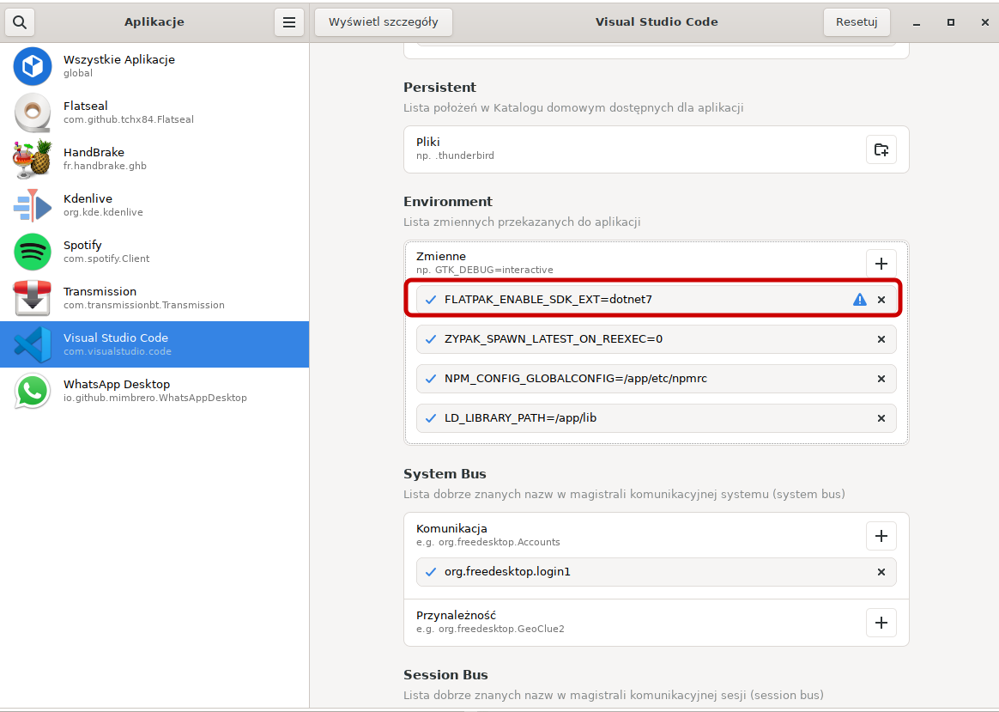

# Building and debugging netcore apps in VS Code

VS Code is much more lightweight IDE compared to VS. 
It can be configured as IDE for many programming languages; for C# it works great with cross-platform .NET development (e.g. dotnet 7.0).
Unfortunately only core of VS Code is FOSS (Free and Open Source Software), full VS Code distribution is propriatary. 

## Configure VS Code

1. Install VS Code
2. In WSL, install dotnet, assuming ubuntu distro (at the time of writing this, dotnet 7.0 is not yet available on ubuntu repos, microsoft repo needs to be added):
 
```shell
wget https://packages.microsoft.com/config/ubuntu/22.10/packages-microsoft-prod.deb -O packages-microsoft-prod.deb 
sudo dpkg -i packages-microsoft-prod.deb
rm packages-microsoft-prod.deb

sudo apt-get update
sudo apt-get install -y dotnet-sdk-7.0
```

3. Install "Remote Development" extension
4. Run VS Code, hit F1 to run Command Palette, run "WSL:  New WSL Window" 
5. Install C# extension (C# for Visual Studio Code (powered by OmniSharp).)
6. Install ".NET Core Test Explorer" extension
7. Obviously, install Dracula Theme extension
8. Open a directory in VS Code explorer
9. In Terminal:

```shell
dotnet new sln
dotnet new console -n Application -o Application
dotnet new nunit -n Application.Test -o Application.Test
dotnet new --list # to see what project types are supported

dotnet sln add **/*.csproj 

dotnet add Application.Test reference Application 

# install some nugets
dotnet add Application.Test package Moq --version 4.18.4

```

9. VS Code needs to add config required to run and debug the application (they will be added to `.vscode` directory). C# extension can do this - when C# project will be open, a prompt will show up ("Required assets to build and debug are missing..") - click yes.
10. All done, switch to "Run and Debug" (Ctrl-Shift-D), set some breakpoint, etc.
11. Open "Testing" perspective to run tests.

## Using VS code from flatpak

On Linux I prefer using VS code from flatpak package.
After installing the VS Code, it is necessary to install proper SDK library from flatpak repo also, e.g.:

```
flatpak install org.freedesktop.Sdk.Extension.dotnet7
```

Next, we need to configure VS Code flatpak sandbox, so that VS Code will "see" the installed SDK. For that matter the Flatseal app can be used. Install flatseal:

```
flatpak install flathub com.github.tchx84.Flatseal
```

Run it:

```
flatpak run com.github.tchx84.Flatseal
```

And configure the variable `FLATPAK_ENABLE_SDK_EXT=dotnet7` :




## Keybindings

| key binding | action |
| ------------- | ----- |
| ctrl-l | mark the whole line, move cursor to next line |
| ctrl+/ | toggle comment for all marked lines (or current line if none selected) |
| ctrl+shift+up ctrl+shift+down | duplicate line |
| alt+up <br/> alt+down | move the selection (or current line) up/down |
| ctlr+alt+up <br/> ctlr+alt+down | add cursor above / below |
| ctrl+up <br/> ctrl+down | scroll file |
| ctrl+shift+p <br/>or F1 | Show all commands |
| ctrl+p | quick open |
| ctrl+d | press it multiple times, to select n occurences of word and then replace them all (so called multi-replace cursor) |
| ctrl+g | go to line number.. |


Visual Studio has different keybinding than VSCode, but they can easily be changed: ` Tools -> Options -> Environment -> Keyboard` and then select scheme "Visual Studio Code".

