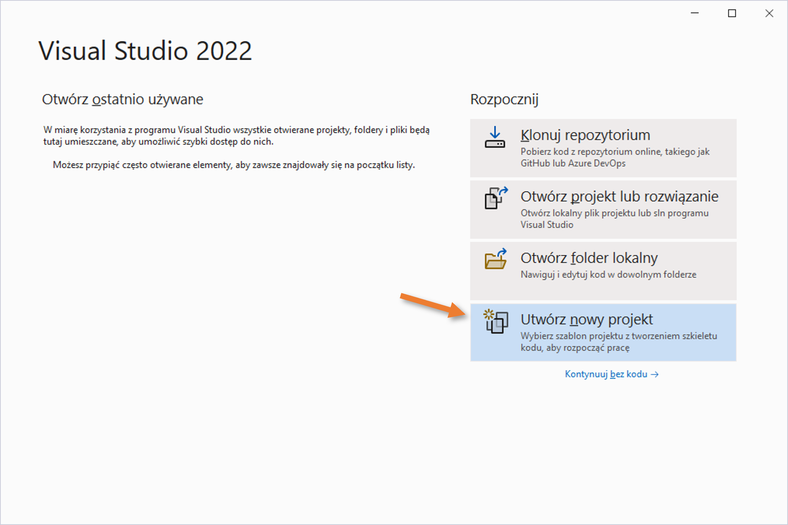
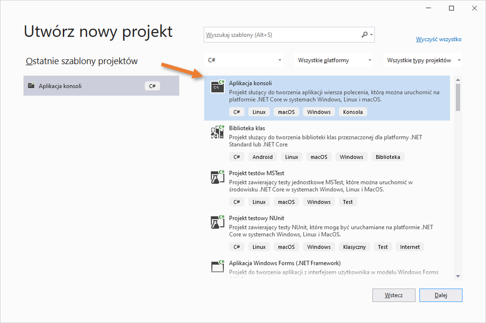
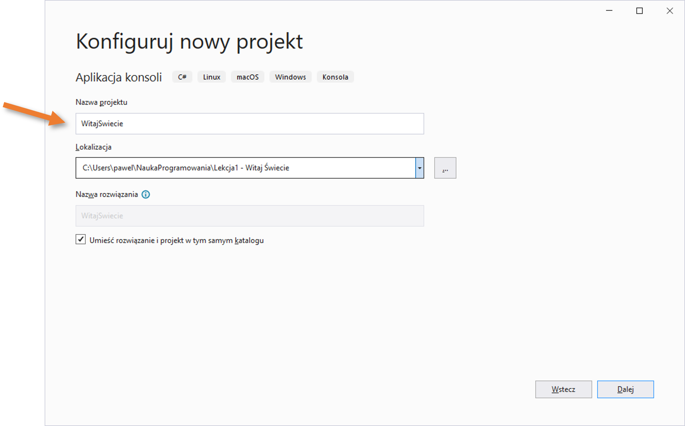
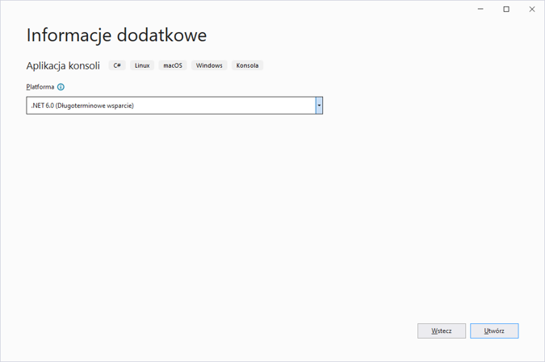
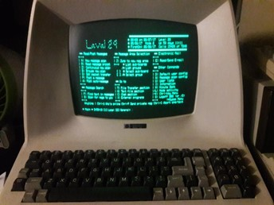
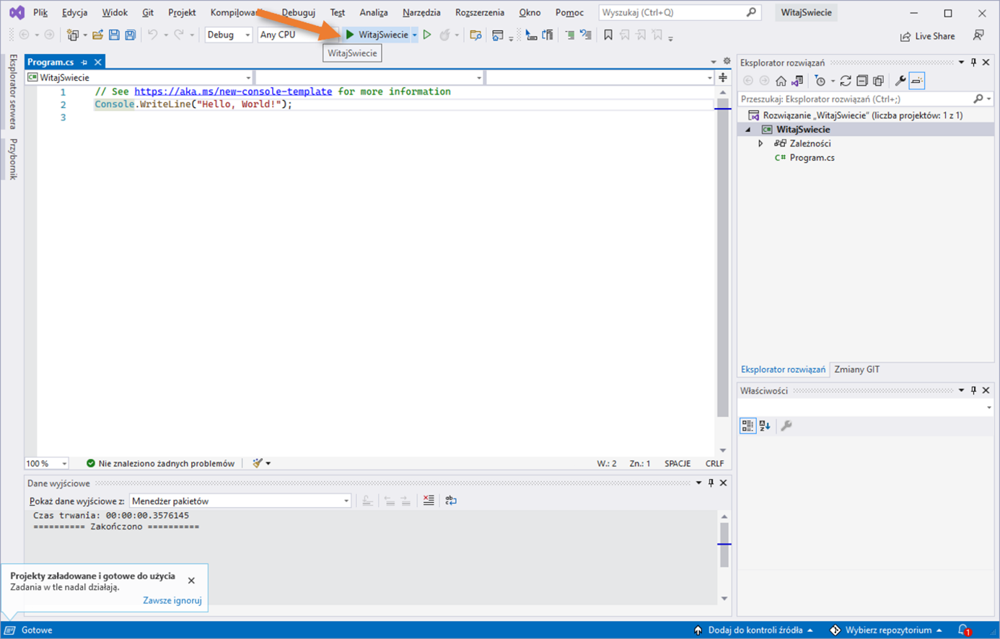
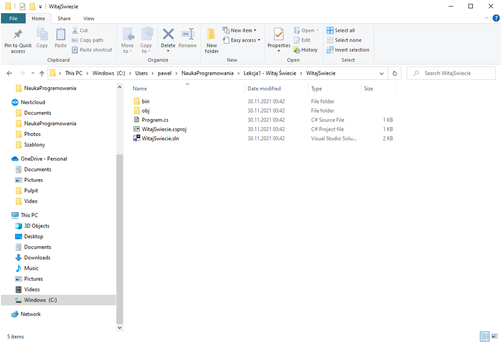

# Podstawy

## Środowisko programistyczne (zwane również jako IDE)

Naszą przygodę z programowaniem zaczniemy od zrozumienia czym jest podstawowe narzędzie używane na co dzień przez każdego programistę. Narzędzie to nazywamy "środowiskiem programistycznym". Wielu programistów określa je skrótem "IDE" (z angielskiego "Integrated Development Environment" czyli "Zintegrowane Środowisko Programistyczne"):

- Jest to program, który ułatwia programowanie – a więc jest podstawowym narzędziem pracy każdego programisty.
- w środowisku programistycznym możemy pisać programy w różnych językach programowania oraz uruchamiać napisane przez nas programy.
- środowisko programistyczne pozwala na wiele innych, bardziej zaawansowanych funkcji (ale będziemy je poznawać później, jak już opanujemy podstawy).

Przykładowe środowiska programistyczne:
 - Scratch (służące głownie do nauki podstaw programowania przez dzieci)
 - Visual Studio
 - IntelliJ IDEA.
i dużo, dużo innych.

Do naszej nauki wybrałem środowisko Visual Studio, które (m.in.) do zastosowań prywatnych jest bezpłatne. Pozwala ono na pisanie programów na platformie .NET, w szczególności – w języku programowania C#.

Platforma .NET jest zbiorem bibliotek, które znajdują się w każdym współczesnym systemie Windows, jak również dostępne jest na inne popularne systemy np. MacOS (używany w komputerach firmy Apple). Oznacza to, że napisany przez nas program będzie możliwy do uruchomienia na każdym systemie Windows (oraz również na innych systemach – np. komputerach Apple).

## Język programowania

Każdy program komputerowy powstaje przy użyciu jakiegoś języka programowania.

Język programowania składa się ze słów, które:

 - z jednej strony – potrafi zrozumieć człowiek (programista), dzięki czemu może on stworzyć
 - z drugiej strony – są zrozumiałe przez komputer, który potrafi wykonać zapisane przez programistę instrukcje.

Ale uwaga! Żeby program mógł zostać zrozumiany i uruchomiony przez komputer, programista musi przestrzegać pewnych zasad, które panują w danym języku programowania.

Przykładowe języki programowania:
- C#,
- Python,
- Java,
- Go,
i… oczywiście: wiele, wiele innych.

Do naszej nauki wybrałem język C# (czytamy "si szarp") w wersji 10.

## Jak stworzyć swój pierwszy program w Visual Studio?

Pierwszym krokiem, który trzeba wykonać jest zainstalowanie środowiska programistycznego na naszym komputerze. Visual Studio można pobrać ze strony internetowej:

[https://visualstudio.microsoft.com/pl/](https://visualstudio.microsoft.com/pl/)

Pod tym adresem znajduje się link pozwalający zainstalować **Visual Studio Community** (jest to bezpłatna wersja Visual Studio) dla systemu Windows.

Podczas instalacji należy zaznaczyć, że będziemy chcieli tworzyć aplikacje "konsolowe". Pomocna może być również instalacja polskiego pakietu językowego.

Po zainstalowaniu IDE (czyli Visual Studio) czas stworzyć nasz pierwszy projekt programistyczny.

Po uruchomieniu Visual Studio:

1. Klikamy opcję "Utwórz nowy projekt"

_Uwaga: zainstalowane przez Ciebie Visual Studio prawdopodobnie wygląda nieco inaczej – posiada tzw. "ciemny motyw" (czarne okna i białą czcionkę). Ja zmieniłem motyw na jasny, ponieważ tak lepiej wygląda na wydruku. Ty możesz pozostawić ciemny motyw, gdyż mniej męczy on oczy._

2.  Na kolejnym ekranie wybieramy z listy szablon "Aplikacja konsoli":
   
3. Teraz musimy wpisać nazwę naszego projektu (ja wymyśliłem sobie nazwę "WitajSwiecie") oraz miejsce w systemie plików (czyli na dysku komputera) gdzie projekt ma być utworzony (ja wybrałem katalog `"C:\Users\pawel\NaukaProgramowania\Lekcja1 – Witaj Świecie"`, jednak Ty możesz wybrać inne miejsce na swoim komputerze.  
   Na koniec – pozostaw zaznaczoną opcję "Umieść rozwiązanie i projekt w tym samym katalogu" (tę opcję możemy użyć dla mniej złożonych projektów).
   
   4. Na kolejnym ekranie (który pojawi się po naciśnięciu przycisku "Dalej") musimy wybrać wersję tzw. "platformy" czyli biblioteki, która będzie odpowiadała za uruchamianie naszego programu. Pozostawmy proponowaną przez Visual Studio wersję (w moim przypadku ".NET 6.0").
      5.  Klikamy przycisk "Utwórz" i .. po chwili nasz pierwszy projekt jest już utworzony! 
Na ekranie widzimy:

- na samej górze zestaw opcji Visual Studio (tak zwane "menu": Plik, Edycja, Widok, itd..)
- w kolejnej linijce zestaw przyrządów (tzw. Toolbar), który jest w zasadzie zbiorem skrótów do najbardziej przydatnych funkcji.
- po środku ekranu widzimy duży obszar, w którym możemy pisać tekst (a więc kod naszego programu). Co ciekawe, system sam stworzył dla nas plik o nazwie "Program.cs" i wstawił do niego dwie linijki tekstu (jako przykładowy, najbardziej podstawowy program w języku C#). Nie róbmy w nim na razie żadnych zmian.
- po prawej stronie widzimy "Eksplorator rozwiązania". Pokazuje on wszystkie elementy z których składa się kod pisanego przez nas programu (nie skupiajmy się jednak na razie na eksploratorze, poznamy go lepiej później, kiedy nasze programy staną się bardziej złożone).
- Na dole znajduje się jeszcze pewien obszar nazwany jako "Dane wyjściowe". Nie jest on w tej chwili dla nas bardzo istotny (Visual Studio używa ten obszar do wyświetlania użytkownikowi przeróżnych informacji).

Ok, wróćmy do pliku `Program.cs`: co robią te dwie linijki, które stworzył dla nas Visual Studio?

- pierwsza w zasadzie nie robi nic, ponieważ jest tylko komentarzem – w języku C#, wszystkie napisy zaczynające się od znaków "//" – aż do końca linijki – są pomijane przez komputer w trakcie uruchamiania programu. Są traktowane jako komentarz, czyli np. krótką notatkę programisty lub informację którą twórca programu chce przekazać innym programistom, którzy będą w przyszłości pracować nad tym samym projektem. Zatem pierwsza linijka to tylko informacja od twórców Visual Studio do nas, że pod podanym adresem możemy znaleźć więcej informacji,
- druga linijka uruchamia funkcję "WriteLine" w klasie "Console" i przekazuje do tej funkcji parametr "Hello, World!". Żeby wyjaśnić co tutaj się dzieje trzeba najpierw zrozumieć … czym jest konsola.

W zasadzie, już wcześniej mieliśmy do czynienia z terminem "konsola", ponieważ podczas tworzenia naszego projektu wybraliśmy szablon o nazwie "Aplikacja konsoli" ("szablon" to inaczej "rodzaj projektu").

Konsola w systemie Windows (jak również w innych systemach operacyjnych) to reprezentacja urządzenia, które w dawnych czasach służyło do obsługi komputera. W czasach, kiedy jeszcze nie istniały tak zaawansowane systemy jak dziś – komputery obsługiwało się w tak zwanym "trybie tekstowym", a więc odczytywało się tekst z ekranu oraz wpisywało się polecenia przy pomocy klawiatury (nie było więc okienek, myszki i tak zwanego "graficznego interfejsu użytkownika"). Wyglądało to mniej więcej tak 😊:



Oczywiście dziś mamy o wiele lepsze komputery, które pozwalają w wygodniejszy sposób obsługiwać programy (przede wszystkim przy użyciu środowiska graficznego - czyli za pomocą okienek, przycisków itp.). Niestety, pisanie takich programów (z zastosowaniem graficznych elementów) wymaga nieco więcej wiedzy. Na początek warto zacząć od czegoś prostszego. Na szczęście, po dziś dzień wszystkie znane systemy operacyjne (czyli na przykład Windows) posiadają program, który reprezentuje tę dawną konsolę (czyli zachowuje się mniej więcej tak, jak te stare, "magiczne" komputery). W systemie Windows jest to tzw. "Wiersz poleceń" (_Command Prompt_, możemy go uruchomić wpisując `cmd` w menu "Start") i wygląda mniej więcej tak:


Przy użyciu konsoli możemy uruchamiać programy które – przede wszystkim – potrafią:

- Pisać tekst na ekranie,
- Odczytywać wpisane przy użyciu klawiatury polecenia.

Te programy są właśnie "aplikacjami konsoli". Być może nie wyglądają one tak dobrze jak programy napisane przy użyciu grafiki (okienek, itp.) ale są z pewnością dobrym wyborem do nauki podstaw programowania, ponieważ nie wymagają szerokiej wiedzy np. o funkcjach systemu operacyjnego obsługujących tryb okienkowy, mysz, itp.

Ok, teraz już wiemy czym jest konsola i dlaczego warto od niej zacząć podczas nauki programowania. Teraz wróćmy do linijki naszego kodu:

```csharp
Console.WriteLine("Hello, World!");
```
Co mówi komputerowi ta linijka? Przede wszystkim słówko "Console" odwołuje się do tak zwanej "klasy". Klasa jest jednym z podstawowych elementów składowych języka C#. Opisuje ona – między innymi – zbiór funkcji które można wykonać (funkcje te będziemy nazywać "metodami"). W platformie .NET istnieje wiele dostępnych klas, z których można skorzystać. Część z nich została stworzona przez twórców języka (czyli firmę Microsoft), część – przez społeczność programistów, którzy udostępniają stworzone przez siebie klasy. Oczywiście sami również możemy tworzyć własne klasy (ale o tym będziemy uczyć się nieco później).

Jedną z wielu dostępnych dla programistów klas jest właśnie `Console`. Przy jej użyciu możemy wykonywać podstawowe operacje, które potrafią "aplikacje konsolowe" a więc, między innymi:

- pisać na ekranie,
- odczytywać polecenia wpisane przy pomocy klawiatury.

`WriteLine` jest jedną z metod, którą twórcy C#/.NET udostępnili nam w klasie "Console". W języku C# podajemy nazwę takiej metody zaraz po nazwie klasy, rozdzielając je kropką (` . `). Zadaniem metody `WriteLine` jest napisanie tekstu "na konsoli". Oczywiście musimy też do tej metody podać tekst, który chcemy napisać (w naszym przypadku jest to `"Hello, World!"`). W języku C#, informacje które potrzebuje metoda do swojego działania to tak zwane "parametry metod" (zwane też "argumentami"). Podajemy je w nawiasie, po nazwie metody. Na sam koniec musimy jeszcze napisać średnik, który informuje, że jest to już koniec naszej "instrukcji".

## Skompilowanie i uruchomienie programu

Teraz już rozumiemy co oznacza kod naszego pierwszego programy. Czas go uruchomić i sprawdzić, czy rzeczywiście będzie on działać tak, jak oczekujemy. Możemy to zrobić bardzo łatwo, poprzez odpowiednią funkcję naszego środowiska programistycznego Visual Studio: wystarczy wcisnąć przycisk wyglądający jak przycisk "Play" w odtwarzaczu płyt: ma on postać zielonego trójkąta skierowanego w prawą stronę (przy nim znajduje się nazwa naszego projektu):


Po naciśnięciu tego przycisku, uruchomi się automatycznie wiersz poleceń systemu Windows:


Jak widzimy, wewnątrz wiersza poleceń ("konsoli") na samym początku wyświetlił się oczekiwany przez nas napis "Hello, World!".

Następnie, wyświetlonych zostaje jeszcze kilka dodatkowych komunikatów mówiących o tym, że działanie naszego programu się zakończyło oraz – abyśmy mieli szansę odczytać wynik działania programu zanim konsola zostanie zamknięta – proszeni jesteśmy o naciśnięcie dowolnego klawisza.

**Gratulacje!** Właśnie stworzyłeś i uruchomiłeś swój pierwszy program napisany w języku C#!!

Zanim przejdziemy do dalszych rozdziałów warto jednak zrozumieć co właściwie się wydarzyło po naciśnięciu przycisku z zielonym trójkącikiem.

Otóż, zanim komputer był w stanie uruchomić nasz program, środowisko programistyczne Visual Studio dokonało pewnej ważnej rzeczy. Być może nie wszyscy byli w stanie to zauważyć (ponieważ wydarzyło się to automatycznie, niejako "w tle"), ale zanim nasza aplikacja konsoli uruchomiła się –kod naszego programu został przetłumaczony ze zrozumiałego dla ludzi języka (C#) na język, który potrafi zrozumieć komputer z systemem operacyjnym Windows.  Proces ten nazywamy kompilacją a specjalny program, który dokonuje tej czynności – nazywamy kompilatorem.

Kompilator, zanim dokona tego "tłumaczenia", najpierw sprawdzi, czy program jest napisany z zastosowaniem reguł jakie panują w języku C# (spokojnie, poznamy te reguły już niedługo!). Jeśli reguły te nie będą spełnione – zgłosi błąd i nie pozwoli uruchomić takiego programu.

_Uwaga! Nie wszystkie języki programowania używają kompilatorów. Niektóre języki programowania (zwane też językami skryptowymi) są "interpretowane" przez komputer już podczas samego wykonywania (w zasadzie są tłumaczone na sposób zrozumiały przez komputer niejako w trakcie samego wykonywania). Zarówno języki kompilowane, jak też i "interpretowane" mają swoje zalety jak i wady. Jednak podczas naszej pierwszej przygody z programowaniem nie będziemy rozstrzygać, które podejście jest lepsze w danej sytuacji. Do naszej nauki wybraliśmy język C#, który jest językiem kompilowanym i tego będziemy się trzymać_ 😊.

## Przegląd struktury projektu i rozwiązania ("solucji")

Na zakończenie pierwszej części przygody z programowaniem, sprawdzimy jakie pliki powstały podczas tworzenia naszego pierwszego programu. Otwórzmy "Eksplorator plików" systemu Windows i przejdźmy do katalogu w którym utworzyliśmy nasz program (w moim przypadku było to `C:\Users\pawel\NaukaProgramowania\Lekcja1 - Witaj Świecie`). Jak widzimy wewnątrz znajduje się kolejny katalog o nazwie takiej samej, jak nazwa naszego projektu. Wejdźmy do tego katalogu:
	
Widzimy tam dwa katalogi i trzy pliki. Wyjaśnijmy czym one są:

- plik `WitajSwicie.sln` jest głównym plikiem całego naszego projektu, nazywanym też  "plikiem rozwiązania" (czy też "solucją" albo – z angielskiego "solution"). W tym pliku znajduje się lista mniejszych "podprojektów" z których może składać się nasz program (w bardziej złożonych programach może być wiele, jednak na początek naszej przygody z programowaniem zawsze będziemy mieć tylko jeden moduł) oraz dodatkowe informacje, które są potrzebne środowisku Visual Studio. Na szczęście nie musimy sami ręcznie tworzyć pliku rozwiązania. Środowisko Visual Studio zrobi to za nas.
- plik `WitajSwiecie.csproj` jest jednym z "podprojektów" (czasami nazywane "modułem") w naszej solucji (i – jak wspomniałem wcześniej, na początek wszystkie nasze projekty będą składać się tylko z jednego modułu). Skrót "csproj" oznacza, że jest to "Projekt C#" czyli moduł napisany w języku C#. Podobnie jak miało to miejsce z plikiem solucji – nie musimy pisać go ręcznie, zrobi to za nas Visual Studio.
- plik `Program.cs` – jest plikiem, który wchodzi w skład naszego modułu. W tym właśnie pliku znajduje się kod naszego programu. Plik taki nazywamy często "plikiem źródłowym", ponieważ jest on tworzony ręcznie przez nas, programistów, i jest "źródłem" na podstawie którego kompilator utworzy program możliwy do uruchomienia przez komputer. To co w tym pliku się znajduje, czyli kod naszego programu (zwany też "kodem źródłowym"), mieliśmy już okazję poznać wcześniej (plik ten wyświetlał nam Visual Studio).
- katalog `obj` jest tworzony przez kompilator i używany przez niego jako pewien "brudnopis" podczas wykonywania kompilacji. Pliki znajdujące się w katalogu "obj" nie są kodem źródłowym i nie mają dla nas większego znaczenia.
- katalog `bin` również jest tworzony przez kompilator, który umieszcza tam końcowy wynik swojego działania, a więc program zapisany w postaci rozumianej przez komputer z systemem Windows. Między innymi znajdziemy tam plik (w podkatalogu `Debug\net6.0`) o nazwie `WitajSwiecie.exe`. Ten plik jest tak zwanym "plikiem wykonywalnym", czyli inaczej mówiąc – aplikacją, którą można uruchomić w systemie Windows 😊.

## Podsumowanie

Poniżej przedstawiam listę najważniejszych rzeczy, których nauczyliśmy się w pierwszej części naszej przygody z programowaniem:

- wiemy co to jest Środowisko Programistyczne (nazywane przez wielu programistów: "IDE"),
- wiemy co to jest język programowania,
- potrafimy zainstalować środowisko Visual Studio w systemie Windows,
- potrafimy stworzyć projekt według szablonu "Aplikacja Konsoli" w środowisku Visual Studio,
- rozumiemy co to jest konsola i dlaczego zaczynamy naukę programowania właśnie przy jej wykorzystaniu,
- wiemy co oznacza następująca linia kodu w języku C#:

```
Console.WriteLine("Hello, World!");
```

- potrafimy uruchomić aplikację przy użyciu Visual Studio,
- wiemy co oznacza słowo "kompilacja" oraz co to jest "kompilator",
- rozumiemy czym jest rozwiązanie (czyli solucja z ang. "solution") oraz co jeszcze znajduje się w katalogu naszego projektu.

Teraz spędź trochę czasu, żeby poznać nieco lepiej środowisko Visual Studio. Spróbuj kliknąć w menu główne: "Plik", "Edycja" itp., żeby zobaczyć jakie opcje są dostępne. Nie bój się, że tych opcji jest aż tak dużo! Nie musimy ich wszystkich od razu używać 😊. Spróbuj wpisać coś w polu szybkiego wyszukiwania (Ctrl-Q), np. "jezyk" ("language") żeby zmienić język z polskiego na angielski (lub odwrotnie). Wpisz "motyw" ("theme") aby zmienić wygląd z jasnego na ciemny lub odwrotnie.

Pobaw się edytorem kodu źródłowego. Zamień test "Hello, World!" na nasze “Witaj, świecie!". Dopisz swój własny komentarz (czyli linijkę zaczynającą się od "//").
